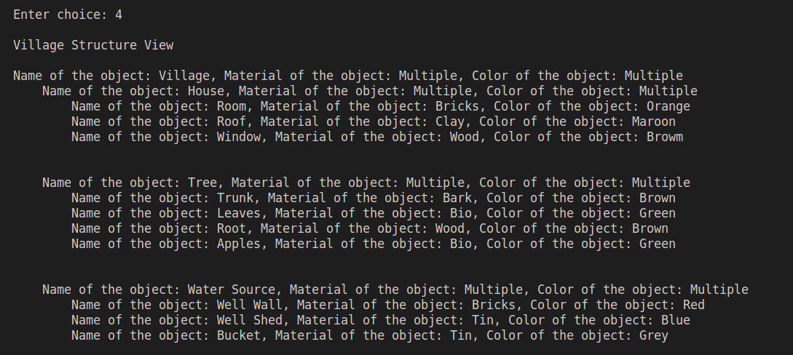

# Report

In composite pattern, an object can be made up of similar type of objects. The __BaseShape__ class is the class used to implement all the attributes and functions of the shapes. It has 4 member variables __name__, __material__,__color__ and a list of BaseShape objects called __shapePart__. It stores the shapes that make up the composite shape which is a shape that is made up using simpler basic shapes. In this project, the basic shapes used are __Square__, __Rectangle__, __Triangle__, __Circle__ and __Cylinder__. The composite shapes reflect the objects in the  game  __Age of villagers__. The objects are __House__ which is made up of a roof,room and a window(Triangle, Rectangle ,Square), __Tree__ which has a trunk,leaves, root and fruits(Rectangle,Circle,Triangle, Circle) and a __WaterSource__ which has a wall for the well, a shed for the well and a bucket to carry the water(Circle, Triangle,Cylinder).

The driver code for this assignment is __Composite.java__. Once the program is initiated it will prompt a menu which whill display numbers denoting what you want to do 
1. Exit
2. House
3. Tree
4. Water Source
5. View Village

The first action will close the program. The second, third and fourth object will build the objects respectively. The final option will display the village with indentation to denote hierarchy

